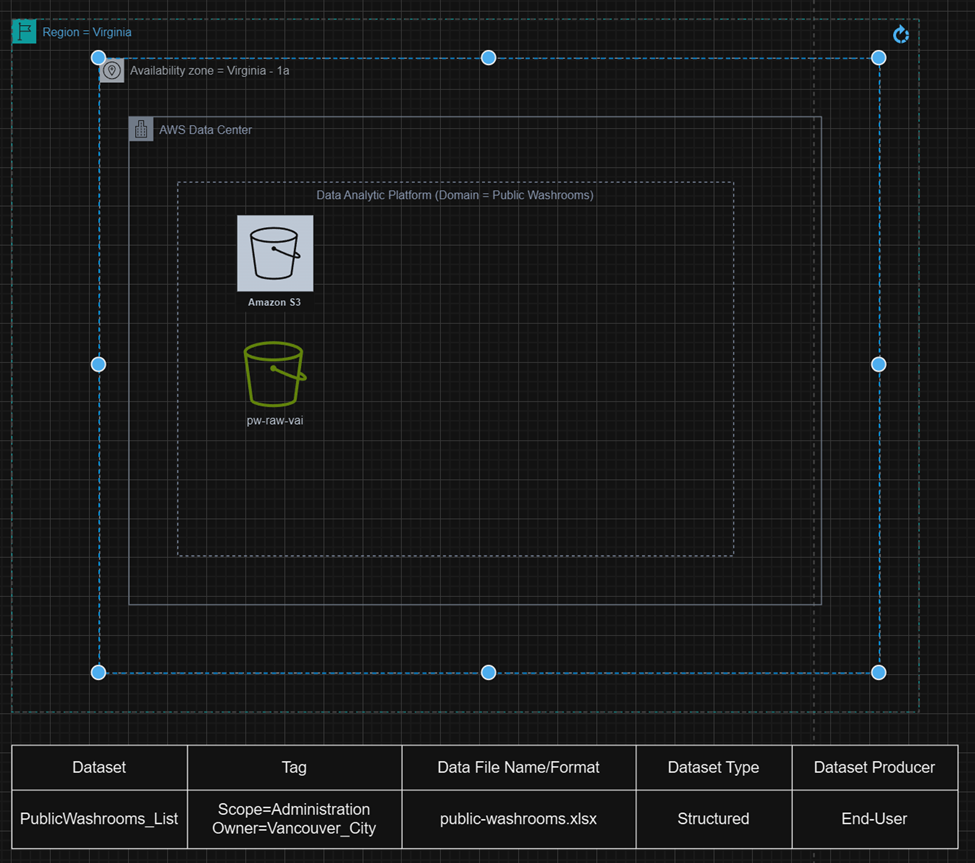
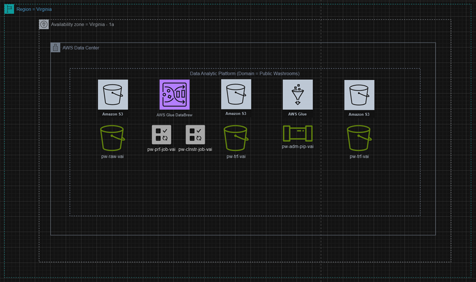
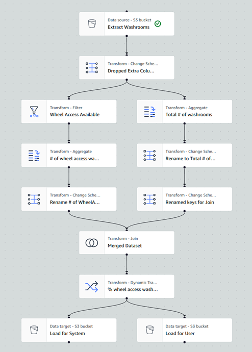
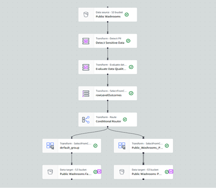
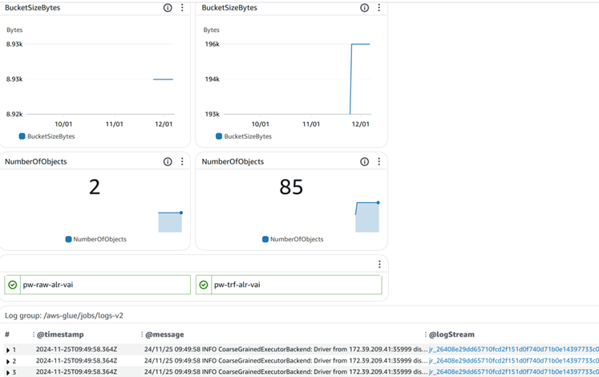

# aws-dataAnalysis-vancouverPublicWashrooms-vaibhav

## **README: Analysis of Public Washrooms in Vancouver**

---

## **Project Title**  
**Descriptive and Predictive Analysis of Public Washrooms Dataset**

---

## **Objective**  
The project aims to analyze the accessibility of public washrooms in Vancouver using a dataset from the City of Vancouver. Key objectives include:  
1. **Descriptive Analysis:**  
   - Calculate the percentage of washrooms with wheelchair access.
   - Explore the relationship between wheelchair access and washroom types.  
2. **Predictive Analysis:**  
   - Identify patterns and trends in accessibility features.  
   - Derive actionable insights to improve city planning and inclusivity.  

---

## **Dataset**  
**Source:** City of Vancouver Open Data Portal  
**Key Features:**  
- **Name:** Public washroom location and details.  
- **Wheelchair Access:** Indicates if the washroom is wheelchair accessible.  
- **Washroom Type:** Types include Automated, Park Washrooms, Portable, etc.  
- **Geolocation:** Latitude and longitude of the washrooms.  
- **Open/Close Hours:** Timings when the washrooms are operational.  

**Dataset Link:** [Public Washrooms](https://opendata.vancouver.ca/explore/dataset/public-washrooms/information/)  

---

## **Methodology**  

### **Step 1: Data Ingestion**  
- **Process:**  
  - Data stored in **AWS S3 Raw Bucket**.  
  - Files ingested into AWS Glue for further processing.  
- **Outcome:** Data made available for profiling and cleaning.  

*Diagram:*  
  

### **Step 2: Data Profiling**  
- **Process:**  
  - Profiling in **AWS Glue DataBrew** to identify missing or anomalous data.  
- **Outcome:** Generated a clean summary of data for preparation.  

### **Step 3: Data Cleaning**  
- **Process:**  
  - Create a **recipe** in DataBrew for automated cleaning.  
  - Handle missing data and normalize fields for consistency.  
- **Outcome:** Transformed dataset stored in **Transformed Bucket** in S3.  

*Diagram: Cleaning & Profiling*  
  

### **Step 4: Data Pipeline Design**  

  

- **Process:**  
  - Implemented ETL pipeline in AWS Glue for processing.  
  - Calculated percentage of wheelchair-accessible washrooms by type.  
- **Outcome:**  
  - Result: 45.45% of Automated Washrooms are wheelchair accessible.  
  - Output stored in CSV (user-readable) and Parquet (system-optimized) formats.  

*Diagram:*  
  

### **Step 5: Data Enrichment**  
- **Process:**  
  - Created a data catalog in AWS Glue with crawlers.  
  - Ran queries in **AWS Athena** for enriched insights.  
- **Outcome:** Improved data usability with metadata and additional context.

  Data Governance Pipeline
  
  

  Dashboard
  
  

---

## **Tools and Technologies**  
- **AWS Services:** S3, Glue, DataBrew, Athena, CloudWatch, KMS.  
- **Languages/Frameworks:** Python (Pandas, Matplotlib), Power BI.  

---

## **Insights and Findings**  
1. **Key Metrics:**  
   - Only **5.74% of all washrooms** are wheelchair accessible.  
   - Automated Public Toilets contribute to the majority of accessible washrooms.  
2. **Trends:**  
   - Accessibility is concentrated in specific washroom types.  
   - Significant gaps exist in inclusivity for other types.  

---

## **Recommendations**  
1. **Policy Recommendations:**  
   - Prioritize wheelchair accessibility upgrades for park and portable washrooms.  
2. **Infrastructure:**  
   - Implement accessibility metrics in new public infrastructure projects.  
3. **Technology:**  
   - Use real-time monitoring (e.g., IoT) for serviceability and maintenance.  

---

## **Deliverables**  
- **Interactive Dashboards:** Accessibility trends via AWS QuickSight.  
- **Analysis Reports:** Comprehensive documentation of findings and methodology.  
- **Data Pipeline:** Reproducible ETL pipeline for future data analyses.  

---

This project underscores the importance of inclusivity in public facilities and provides actionable insights to improve accessibility in Vancouver.
